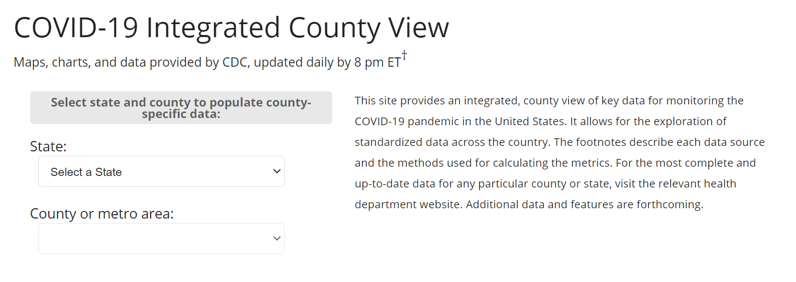

# covid_countylevel_vaccines

R code for pulling down CDC county-level vaccination dataset that lives behind the agency's dashboard [here](https://covid.cdc.gov/covid-data-tracker/#county-view).

Inspired by Python version of the same by Matt Stiles [here](https://github.com/stiles/notebooks/blob/master/coronavirus/11-vaccine-counties.ipynb).
